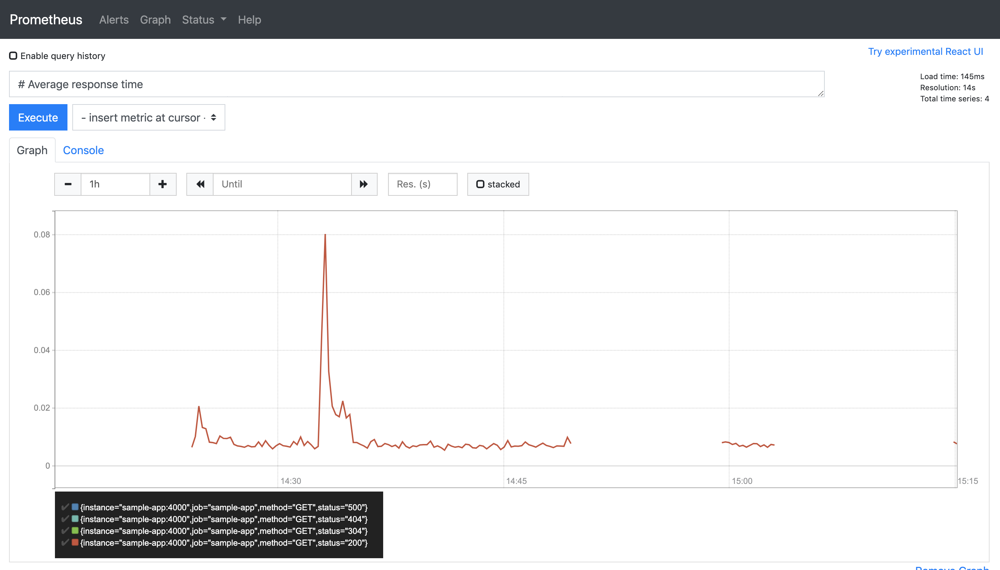

# Prometheus, Grafana and Node.js Sample App

Monitoring a Node.js application using [Prometheus](https://prometheus.io) and Visualization usinf [Grafana](https://grafana.com/)




### Start the application

```bash
$ docker-compose up -d
```

### Stop the application

```bash
$ docker-compose down
```

### Clean up

Run the following command to stop all running containers from this project:

```bash
$ docker-compose rm -fs
```
